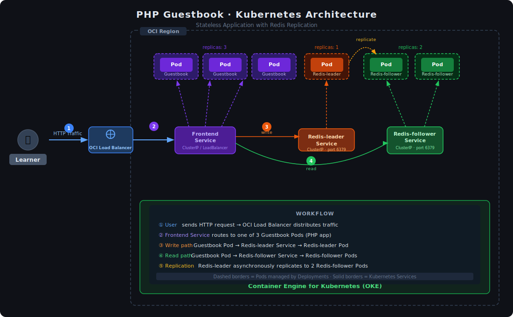

# 📒 Deploying PHP Guestbook Application with Redis

A hands-on demonstration of deploying a multi-tier **PHP Guestbook** application on Kubernetes, featuring a Redis leader/follower replication pattern. This project supports two deployment paths:

- **Oracle Kubernetes Engine (OKE)** — production-grade cloud deployment on OCI
- **Local / Playground** — quick start using Minikube or free online Kubernetes playgrounds

> Based on the official Kubernetes tutorial: [Deploying PHP Guestbook application with Redis](https://kubernetes.io/docs/tutorials/stateless-application/guestbook/)

---

## 📐 Architecture



### Workflow

| Step | Description |
|------|-------------|
| **① HTTP Traffic** | User sends a request → OCI Load Balancer (or NodePort) distributes traffic into the cluster |
| **② Frontend Service** | Routes traffic to one of 3 Guestbook PHP Pods via ClusterIP service |
| **③ Write path** | Guestbook Pod → `redis-leader` Service → Redis Leader Pod (stores data) |
| **④ Read path** | Guestbook Pod → `redis-follower` Service → one of 2 Redis Follower Pods (serves reads) |
| **⑤ Replication** | Redis Leader asynchronously replicates data to both Redis Follower Pods |

### Components

| Component | Image | Replicas | Role |
|-----------|-------|----------|------|
| Guestbook Frontend | `gb-frontend:v5` | 3 | PHP web app (stateless) |
| Redis Leader | `registry.k8s.io/redis` | 1 | Primary data store (writes) |
| Redis Follower | `gb-redis-follower:v2` | 2 | Read replicas |

---

## 📁 Repository Structure

```
k8s-guestbook/
├── manifests/
│   ├── redis-leader-deployment.yaml          # Redis Leader Deployment (1 replica)
│   ├── redis-leader-service.yaml             # Redis Leader ClusterIP Service
│   ├── redis-follower-deployment.yaml        # Redis Follower Deployment (2 replicas)
│   ├── redis-follower-service.yaml           # Redis Follower ClusterIP Service
│   ├── frontend-deployment.yaml              # PHP Guestbook Deployment (3 replicas)
│   ├── frontend-service-loadbalancer.yaml    # Frontend Service - for OKE (cloud)
│   └── frontend-service-nodeport.yaml        # Frontend Service - for Minikube/Playgrounds
├── scripts/
│   ├── deploy-oke.sh                         # One-shot deploy script for OKE
│   ├── deploy-local.sh                       # One-shot deploy script for local/playground
│   └── cleanup.sh                            # Remove all resources from cluster
├── docs/
│   └── architecture.svg                      # Architecture diagram
└── README.md
```

---

## ✅ Prerequisites

- `kubectl` installed and configured
- A running Kubernetes cluster (see options below)
- Kubernetes server version **≥ v1.14**

Verify your connection:
```bash
kubectl version
kubectl cluster-info
```

---

## 🚀 Option 1 — Oracle Kubernetes Engine (OKE)

OKE is Oracle Cloud Infrastructure's managed Kubernetes service. It provisions an OCI Load Balancer automatically when you use `type: LoadBalancer` in your Service.

### 1.1 Prerequisites for OKE

- OCI account with an active tenancy
- OCI CLI installed and configured (`oci setup config`)
- OKE cluster created (via OCI Console, CLI, or Terraform)
- kubeconfig downloaded for your cluster:

```bash
oci ce cluster create-kubeconfig \
  --cluster-id <your-cluster-ocid> \
  --file $HOME/.kube/config \
  --region <your-region> \
  --token-version 2.0.0
```

Verify access:
```bash
kubectl get nodes
```

### 1.2 Deploy with Script

```bash
git clone https://github.com/<your-username>/k8s-guestbook.git
cd k8s-guestbook
chmod +x scripts/deploy-oke.sh
./scripts/deploy-oke.sh
```

### 1.3 Deploy Manually (Step by Step)

**Step 1 — Redis Leader**
```bash
kubectl apply -f manifests/redis-leader-deployment.yaml
kubectl apply -f manifests/redis-leader-service.yaml
```

**Step 2 — Redis Followers**
```bash
kubectl apply -f manifests/redis-follower-deployment.yaml
kubectl apply -f manifests/redis-follower-service.yaml
```

**Step 3 — Guestbook Frontend**
```bash
kubectl apply -f manifests/frontend-deployment.yaml
kubectl apply -f manifests/frontend-service-loadbalancer.yaml
```

**Step 4 — Verify Deployment**
```bash
kubectl get pods
kubectl get services
```

**Step 5 — Get the External IP**
```bash
kubectl get service frontend --watch
```

Once `EXTERNAL-IP` is assigned by OCI Load Balancer, open:
```
http://<EXTERNAL-IP>
```

> ⏱ OCI Load Balancer provisioning typically takes 1–3 minutes.

### 1.4 OKE-Specific Tips

- The Load Balancer is provisioned in your OCI tenancy automatically. Check **Networking → Load Balancers** in the OCI Console.
- To configure a specific Load Balancer shape or bandwidth, add annotations to the Service:

```yaml
metadata:
  annotations:
    oci.oraclecloud.com/load-balancer-type: "lb"
    service.beta.kubernetes.io/oci-load-balancer-shape: "flexible"
    service.beta.kubernetes.io/oci-load-balancer-shape-flex-min: "10"
    service.beta.kubernetes.io/oci-load-balancer-shape-flex-max: "100"
```

---

## 💻 Option 2 — Minikube (Local)

Minikube runs a single-node Kubernetes cluster on your machine inside a VM or container.

### 2.1 Prerequisites for Minikube

Install Minikube: https://minikube.sigs.k8s.io/docs/start/

Start a multi-node cluster (recommended for this tutorial):
```bash
minikube start --nodes 2 --cpus 2 --memory 2048
```

Verify:
```bash
kubectl get nodes
```

### 2.2 Deploy with Script

```bash
git clone https://github.com/<your-username>/k8s-guestbook.git
cd k8s-guestbook
chmod +x scripts/deploy-local.sh
./scripts/deploy-local.sh
```

### 2.3 Deploy Manually (Step by Step)

**Step 1 — Redis Leader**
```bash
kubectl apply -f manifests/redis-leader-deployment.yaml
kubectl apply -f manifests/redis-leader-service.yaml
kubectl rollout status deployment/redis-leader
```

**Step 2 — Redis Followers**
```bash
kubectl apply -f manifests/redis-follower-deployment.yaml
kubectl apply -f manifests/redis-follower-service.yaml
kubectl rollout status deployment/redis-follower
```

**Step 3 — Guestbook Frontend (NodePort)**
```bash
kubectl apply -f manifests/frontend-deployment.yaml
kubectl apply -f manifests/frontend-service-nodeport.yaml
kubectl rollout status deployment/frontend
```

**Step 4 — Verify**
```bash
kubectl get pods
kubectl get services
```

**Step 5 — Access the App**

Option A — Minikube tunnel (opens browser automatically):
```bash
minikube service frontend
```

Option B — Port forwarding:
```bash
kubectl port-forward service/frontend 8080:80
```
Then open: http://localhost:8080

---

## 🌐 Option 3 — Online Kubernetes Playgrounds (No Installation Required)

These free platforms give you a live Kubernetes cluster in your browser. Perfect for quick experimentation.

| Platform | Link | Notes |
|----------|------|-------|
| **iximiuz Labs** | [labs.iximiuz.com](https://labs.iximiuz.com/playgrounds?category=kubernetes&filter=all) | Rich terminal, multi-node support |
| **Killercoda** | [killercoda.com](https://killercoda.com/playgrounds/scenario/kubernetes) | 1-hour session, quick start |
| **KodeKloud** | [kodekloud.com](https://kodekloud.com/public-playgrounds) | Beginner-friendly, guided labs |

### 3.1 Quick Deploy on Any Playground

Once your playground cluster is ready, run these commands directly in the terminal:

```bash
# Clone the repository
git clone https://github.com/<your-username>/k8s-guestbook.git
cd k8s-guestbook

# Make the deploy script executable
chmod +x scripts/deploy-local.sh

# Deploy everything
./scripts/deploy-local.sh
```

Or apply manifests individually (using the official Kubernetes URLs):

```bash
# Redis Leader
kubectl apply -f https://k8s.io/examples/application/guestbook/redis-leader-deployment.yaml
kubectl apply -f https://k8s.io/examples/application/guestbook/redis-leader-service.yaml

# Redis Followers
kubectl apply -f https://k8s.io/examples/application/guestbook/redis-follower-deployment.yaml
kubectl apply -f https://k8s.io/examples/application/guestbook/redis-follower-service.yaml

# Frontend (use NodePort for playgrounds)
kubectl apply -f manifests/frontend-deployment.yaml
kubectl apply -f manifests/frontend-service-nodeport.yaml
```

### 3.2 Access the App on Playgrounds

**Port forwarding** (works on all platforms):
```bash
kubectl port-forward service/frontend 8080:80 --address 0.0.0.0
```
Then use the platform's "Open Port" / "Traffic Port Accessor" feature to access port `8080`.

**NodePort** (if the playground exposes node ports):
```bash
NODE_IP=$(kubectl get nodes -o jsonpath='{.items[0].status.addresses[?(@.type=="InternalIP")].address}')
echo "http://${NODE_IP}:30080"
```

---

## 📊 Verify the Deployment

Check all resources are running:

```bash
# List all pods with status
kubectl get pods -o wide

# List all services
kubectl get services

# Describe the frontend deployment
kubectl describe deployment frontend

# View logs from the Redis leader
kubectl logs -f deployment/redis-leader

# View logs from the frontend
kubectl logs -f deployment/frontend
```

Expected pod output:
```
NAME                              READY   STATUS    RESTARTS   AGE
frontend-6c6d6dfd4d-4nprx         1/1     Running   0          2m
frontend-6c6d6dfd4d-m7dlt         1/1     Running   0          2m
frontend-6c6d6dfd4d-qxt52         1/1     Running   0          2m
redis-follower-dddfbdcc9-82sfr    1/1     Running   0          3m
redis-follower-dddfbdcc9-qrt5k    1/1     Running   0          3m
redis-leader-fb76b4755-xjr2n      1/1     Running   0          4m
```

---

## 📈 Scale the Frontend

Scale up or down the number of frontend replicas:

```bash
# Scale up to 5 replicas
kubectl scale deployment frontend --replicas=5

# Scale down to 2 replicas
kubectl scale deployment frontend --replicas=2

# Verify
kubectl get pods -l app=guestbook
```

---

## 🧹 Cleanup

Remove all resources from the cluster:

```bash
chmod +x scripts/cleanup.sh
./scripts/cleanup.sh
```

Or manually:
```bash
kubectl delete deployment frontend redis-leader redis-follower
kubectl delete service frontend redis-leader redis-follower
```

---

## 🔧 Troubleshooting

**Pods stuck in `Pending` state:**
```bash
kubectl describe pod <pod-name>
# Check "Events" section at the bottom for resource/scheduling issues
```

**`ImagePullBackOff` error:**
```bash
kubectl describe pod <pod-name>
# Verify your cluster has internet access to pull images
```

**Frontend can't connect to Redis:**
```bash
# Verify Redis services are running
kubectl get service redis-leader redis-follower

# Test DNS resolution from inside a pod
kubectl exec -it deployment/frontend -- nslookup redis-leader
```

**OKE Load Balancer not getting an external IP:**
- Check OCI Console → Networking → Load Balancers
- Ensure your OKE node pool has the correct IAM policies
- Check that security list / NSG rules allow port 80 inbound

**Minikube service not opening:**
```bash
# Use port-forward as an alternative
kubectl port-forward service/frontend 8080:80
```

---

## 📚 References

- [Kubernetes Official Tutorial](https://kubernetes.io/docs/tutorials/stateless-application/guestbook/)
- [OCI Container Engine for Kubernetes (OKE)](https://docs.oracle.com/en-us/iaas/Content/ContEng/home.htm)
- [Minikube Multi-Node](https://minikube.sigs.k8s.io/docs/tutorials/multi_node/)
- [iximiuz Labs](https://labs.iximiuz.com/playgrounds?category=kubernetes&filter=all)
- [Killercoda Kubernetes Playground](https://killercoda.com/playgrounds/scenario/kubernetes)
- [KodeKloud Public Playgrounds](https://kodekloud.com/public-playgrounds)
